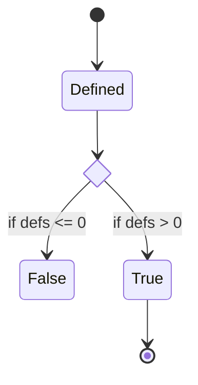

# cim - Composable Information Machine

A distributed knowledge encapsulation system based on functional reactive programming and event sourcing.

`Composable infrastructure` makes data center resources readily available like cloud services and is foundational for solutions in private and hybrid clouds. We incorporate this and relate information into a seamless distributed solution.

We work with enormous amounts of information which continues to grow at exponential rates. From 2020 to 2025 it will grow from [64 to 180 zettabytes](https://www.statista.com/statistics/871513/worldwide-data-created/). We have access to [exabytes](https://www.backblaze.com/blog/what-is-an-exabyte/) of information from all over the universe at our fingertips.

Seriously, you could be doing [data science on telemetry from spacecraft](https://ntrs.nasa.gov/citations/20100021335), or [image classification](https://www.kaggle.com/datasets/puneet6060/intel-image-classification). Most of us have more casual needs, but running any infrastructure today requires quite a lot of information and a way to interchange it effectively, lest you will be the interchange.

## Incorporate information decisions into our daily lives

Currently we spend far to much time processing information that could be fully automated. We can process information that exists all over the internet and obtain sensor input from all over the universe. We should not be thinking of how to re-centralize or relocate all that information, but rather, how to adapt a new process to utilize it and optimize where it sits.

In less than a few centuries, our information devices have exploded from 1, our brain, to a few in books and physical objects, to thousands or even millions of digital and analog sources over our lifetimes.

Your mind can remember only 7-10 distinct things in temporary memory , such as a telephone number, and yet we [forget almost everything we encounter](https://www.ncbi.nlm.nih.gov/pmc/articles/PMC3971378/). Multiple arrays of 4 objects seems to also be an established averge limit. How are we to be able to process all of this information if it just keeps growing all the time?

We need to participate in a world that is demanding more and more from us in order just to participate. We need more knowledge, faster, at more times, to interact with our already stored and processed information, that just keeps growing.

Our brains aren't getting bigger, but our capacity to abstract and relate is getting much better. We have a bunch of Math and Computer Science to handle this, and we will learn some over time. However, we also now have much better understanding of our cognitive abilities and how we are built than we did a hundred years ago when they were developing the theories used in our current computing process flows. We didn't know what [DNA](https://medlineplus.gov/genetics/understanding/basics/dna/) was when the [Univac](https://ethw.org/UNIVAC) was built.

Self-assembly, replication and identification are key ideas that [[DNA]] helps to handle in biology. We have the same needs for information. [[Information Theory]] While we know how the math works to communicate information... structuring it led to centuries of debate.

There are several current theories that take us from the single machine to the connected network, to a truly distributed machine.  We will use and introduce knowledge as the need emerges, most of us aren't interested in becoming theoretical mathematicians or computer scientists, let alone linquists and statisticians. We do however, wish to allow those interested to dive deeply into the theories that make up a [[Composable Information Machine]].

> ## I want to own, understand, process and protect my information needs.

Personal computers were supposed to be a tool for personal liberation, we achieved that. I now have dozens of computers in every room, data all over the internet and programming that goes back decades. Even though we have been talking about [[convergence]] for 30 years, we never achieved it.

It is now critical that we become able to understand our information and how it interacts with us and our environment.  We have achieved something extraordinary in the last 50 years of Information Technology. It became tiny and affordable to everyone. I can buy a $5 postage stamp sized computer that can do quite a bit of processing.

A problem is exposed when we don't program this stuff ourselves, it has been immensely difficult to follow. This is a world filled with jargon, minute details, difficult concepts and bugs... so many bugs.

We humans are adaptive creatures and like to dive into water before thinking about what is in the water, or even if it is water at all. In the information realm, we have an infinite set of possibilities to explore and the only thing stopping us from exploring them all is perceived time.

With some initial planning as to how we present and work with information we can come to an achievable whole greater than the sum of it's parts. It needs to be made from readily accessible and available components which can all be identified, encapsulated and connected. It needs to be able to grow and learn and use new technology and help us understand how to achieve it.

We want a [Composable Information Machine](doc/cim.md). This means both hardware and software are completely identified, defined and `related` in a way we can predictably understand. We will know exactly how the machine works and how it communictes. The machine is a single entity as a whole, made from many parts, connected in an environment, residing in the known universe.

A [Composable Information Machine](doc/cim.md) is a way to encapsulate information in a known, predictable manner in which we are in much more control of our global access to information. We now have a better ability to use it for making decisions that affect our lives rather than us being the sole machine to sort and access our information.

We need to cover structure, construction, types, power, networking, people, hardware and applications.  We assemble these definitions into a set of [Composable Information Machines](doc/cim.md). The set is a fractal. There is really only one machine acting recursively on itself, but that is more difficult to comprehend at first.

### Composable Information Machine

We define an inventory system which, in turn, defines the informational limits and boundaries. We will combine many well-known services, yet see them as related and usable in very specific ways.

We can choose from many [infrastructure resource modeling](doc/irm.md) systems. We need a base that will be the [[source of truth]] for our network. [NetBox](https://docs.netbox.dev/en/stable/) fulfills this for us nicely. Next, where do I put it? Anywhere actually, this is a containerized system, in this guide we will use a Raspberry Pi 4B for the initial system. Expect systems to be replaced over time. This can easily be the biggest, fastest server you want to put it on, we just don't require it.

NetBox is designed to be a centralized single source of truth while a [Composable Information Machine](doc/cim.md) is distributed and partitioned. To accomodate this we will be making two significant adjustments to how we use NetBox. We extend NetBox to have a Write model as well as to use [[Event Sourcing]].

Abstracted interface to the network infrastructure model: 

>* Read Model from NetBox
>* Write Model (abstracted from same then optimized)
>* Event Sourcing
>* Projections to create interaction and read model population

We will use the current NetBox data model as a READ Model for [IRM](doc/irm.md). The Write Model is an abstraction we will create. We could [abstract an API in Rust](https://openapi-generator.tech/docs/generators/rust/) for our use with the Read Model, but there is one already built we can start from: [https://github.com/AmaranthosLabs/rust-netbox]. 

Changes to NetBox directly can be immediately supported through the Logging functionality. Writes will be sent to an [Event Store](https://www.eventstore.com/) through the built-in logging mechanics of NetBox. We can then in parallel work on an optimized interface with this adapter being used to get us up and running.

Projections from the [Event Store](https://www.eventstore.com/) cause various actions to be performed based on the nature of the Event. Events are Strongly Typed and form a [[Type System]] used throughout the [Composable Information Machine](doc/cim.md).

Let's recap so far what we are doing.
We are building a [Composable Information Machine](doc/cim.md)

We require the following in order to do so:

   1. Definition and Design
      * structure (Type System)
      * mapping and flow
      * documentation
      * git and content-addressing
   2. Software Defined Network
      * relationships of compute resources
      * IPAM, VLAN, DNS, DHCP, VPN
      * inventory
   3. Power
      * providers
      * sources and capabilities
   4. Computing Devices
      * hardware and identification
      * virtual network endpoints  
   5. Definition of components
      * what makes up a device
      * setting limits and boundaries for spaces
      * continuous integration and deployment
   6. Secure communication capability
      * channel between nodes
      * command and control separation
      * Identity and Access Management
   7. Persistance
      * Command, Query, Response Segregation [CQRS](https://www.geeksforgeeks.org/what-is-cqrs/) + Event Sourcing [ES](doc/Event%20Sourcing.md) approach
      * Content-Addressing [IPFS](https://ipfs.io)
      * addressable blocks [IPLD](https://ipld.io)
   8. Proofs
      * Proofs of operations
        * How does it work
      * monitoring
        * Show me that it works
      * causality
        * What made it do that
      * game theory
        * What if it does this

Next we will dive into how each one of these is implemented and build a working system.

