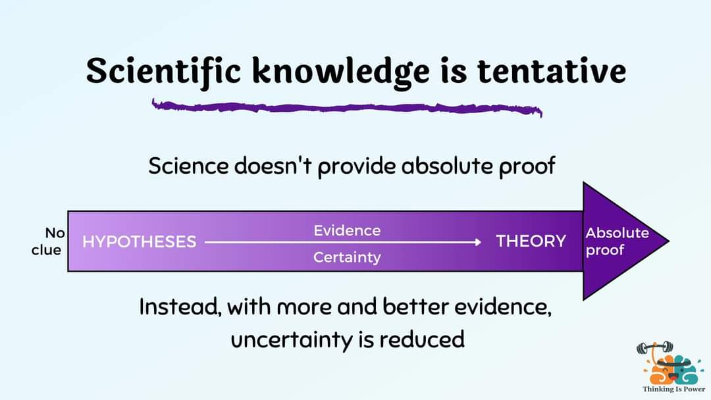

+++
title = "Build a datacenter"
description = ""
date = 2022-09-01
weight = 0
draft = false
in_search_index = true
template = "page.html"
[taxonomies]
  tags = ["cim", "composable", "dcim", "rust"]
  people = ["steele"]

# Your own data.
[extra]
image = "/img/dots.jpg"

+++
We are bonding ceph with event store and projections to ipfs and other clients 
We will be building this from the ground up.

### Basic Concepts
  - [ipfs](/library/ipfs) talks to the public internet
  - [ceph](/library/ceph) is low level storage, it talks to hardware (for us)
  - [Event store](/library/event-store) tells you what is there and how it got there
  - [authentik](/library/Authentik) protects it from outsiders
​
### We combine lots of different ideas to arrive at a [composable information machine](/library/cim).

ceph and ipfs are not typed, it's not their responsibility. We add our own [type systems](/library/type-system) as well as [ipld](/library/ipld), and [several apis](/library/api) to [Ansible Playbooks](/library/ansible), [NetBox]/library/NetBox, [n8n Automation](/library/n8n), [and more](/tools)

We use [hyperconvergence](/library/hyperconvergence) internally to provide a hybrid cloud environment and define within it the structure and relationships of all your information.

    

  - IPFS is another CLIENT
  - RBD is ONLY about blocks in RADOS
  - Event Store is metadata about stuff inside the blocks
  - We tell `ceph` to do some specific things for us to enable a better `ipfs` or any other Client. A Client could be [SOLID](https://solidproject.org/) or some other future way or sharing information.
  - ceph is how we talk to things inside a rack/datacenter/tenant. It helps us to partition information more wisely. 
  - blocks in `ipfs` are translated as a `block storage device` inside [ceph](/library/ceph)

Excellent companies can tell you how to build a 'storage system' yet they refrain from telling you about how to define things about the information within the storage. In fact most of them take great pride in avoiding it. We have traditionally modeled all of this after paper processes.

We are the processes sitting on top of this generic abstracted stuff. We strive eliminate the hierarchical, location based, paper models and embrace instead a well-define system based on [open games](/library/open-games) and [applied category theory](/library/applied-category-theory). Most people don't want to learn this math and hardware stuff to use it. We just want to know it works. 

You only need to learn the idea behind [n8n](/library/n8n), how we will be using it, and [acceptance tests](/library/acceptance-test) to create [business process](/library/business-process).

We will talk a lot about [business process](/library/business-process), [agile](/library/agile) and the [cone of uncertainty](library/cone-of-uncertainty). 

> This is what we directly attack: [chaos](/library/chaos) and [uncertainty](/library/uncertainty).

[Building from Nothing](/articles/build-from-nothing)

---

#### References

[Introduction to ceph](https://youtu.be/7I9uxoEhUdY)

---