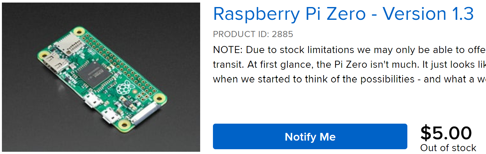

+++
title = "Composable Information Machine"
description = "A distributed knowledge encapsulation system based on Functional Reactive Programming and Event Sourcing"

# The date of the post.
# Two formats are allowed: YYYY-MM-DD (2012-10-02) and RFC3339 (2002-10-02T15:00:00Z).
# Do not wrap dates in quotes; the line below only indicates that there is no default date.
# If the section variable `sort_by` is set to `date`, then any page that lacks a `date`
# will not be rendered.
# Setting this overrides a date set in the filename.
date = 2022-08-03

# The last updated date of the post, if different from the date.
# Same format as `date`.
# updated =

# The weight as defined on the Section page of the documentation.
# If the section variable `sort_by` is set to `weight`, then any page that lacks a `weight`
# will not be rendered.
weight = 0

# A draft page is only loaded if the `--drafts` flag is passed to `zola build`, `zola serve` or `zola check`.
draft = false

# If set, this slug will be used instead of the filename to make the URL.
# The section path will still be used.
# slug = ""

# The path the content will appear at.
# If set, it cannot be an empty string and will override both `slug` and the filename.
# The sections' path won't be used.
# It should not start with a `/` and the slash will be removed if it does.
# path = ""

# Use aliases if you are moving content but want to redirect previous URLs to the
# current one. This takes an array of paths, not URLs.
# aliases = []

# When set to "true", the page will be in the search index. This is only used if
# `build_search_index` is set to "true" in the Zola configuration and the parent section
# hasn't set `in_search_index` to "false" in its front matter.
in_search_index = true

# Template to use to render this page.
template = "page.html"

# The taxonomies for this page. The keys need to be the same as the taxonomy
# names configured in `config.toml` and the values are an array of String objects. For example,
# tags = ["rust", "web"].
[taxonomies]
  tags = ["cim", "composable", "act", "game theory"]
  people = ["steele"]

# Your own data.
[extra]
image = "/img/FunctionalProg.png"

+++

> A [distributed](https://www.splunk.com/en_us/data-insider/what-are-distributed-systems.html) knowledge encapsulation system based on [Functional Reactive Programming](https://codedocs.org/what-is/functional-reactive-programming) and [Event Sourcing](https://www.eventstore.com/blog/what-is-event-sourcing).

## Composable Information Machine

We have achieved something extraordinary in the [last 50 years of Information Technology](https://www.ithistory.org/). IT became tiny and affordable to everyone.  I can buy a $5 postage stamp sized computer that can do enough processing to do real work and it's widely available. 

> The universe is made of [events](/library/events) not objects - [Carlo Rovelli](https://www.closertotruth.com/interviews/55727)

In less than a few centuries, our information devices have exploded from 1, our brain, to a few in books and physical objects, to thousands of digital and analog sources over our lifetimes. We need to participate in a world that is demanding more and more from us in order just to participate. 

Computing today requires lots of information and a way to interchange it effectively, lest *you* will be the interchange. We need a standard way to connect it, relate it and query it. 

We need more knowledge, faster, more often. From 2020 to 2025 it will grow from [64 to 180 zettabytes](https://www.statista.com/statistics/871513/worldwide-data-created/). 

> We want a [Composable Information Machine](/library/cim).

A [Composable Information Machine](/library/cim) is a collection of computing devices (hardware), a collection of [states](/library/state), a [Type System](/library/type-system), and a recorded [sequence of events](/library/event-sourcing) and a [peer-to-peer](/library/p2p) [messaging system](/library/messaging).

We connect several [Sources of Truth](/library/sot) to several [Systems of Record](/library/sor) with a secure [peer-to-peer](https://www.merriam-webster.com/dictionary/peer-to-peer) network where we control the peers and the channels. **Everything can suddenly and securely talk.**

## Incorporate information decisions into our daily lives

Currently we spend far to much time processing information that *[could be fully automated](https://n8n.io)*. We can process information that exists all over the internet and obtain sensor input from all over the universe. Instead of re-centralizing or relocating all that information we can now adapt a new process to utilize it and optimize where it sits. Once we put everything in the cloud, retrieving it all at once becomes an impossible feat, even moving it around can become exceedingly difficult.

The 'network' is now ubiquitous with providers like [StarLink](https://starlink.com).

Today, we have much better understanding of our cognitive abilities and how we are built than we did a hundred years ago when they were developing the theories used in our current computing process flows. We didn't know what [DNA](/library/dna) was when the [Univac](https://ethw.org/UNIVAC) was built, yet we still use this same fundamental architecture today.

Self-assembly, replication and identification are key ideas that [DNA](/library/dna) helps to handle in biology. We have the same needs for information. [Information Theory](/library/information-theory) taught us how the math works to communicate information, however, structuring it has led to countless debate.

We will be using a style of structuring based on [Merkle DAGs](https://proto.school/merkle-dags) and accessing them as [Block Storage](https://docs.ipfs.tech/how-to/work-with-blocks/) in a [Metric Space](https://ncatlab.org/nlab/show/metric+space).

Several current theories take us from the single machine to the connected network, on to a truly distributed machine.  Most of us aren't interested in becoming theoretical mathematicians or computer scientists, let alone linquists and statisticians just to understand our budget. We need an easier way to connect everything, without being subject to vendorization or great cost. Those interested may dive deeply into the theories that make up a [Composable Information Machine](/library/cim) we offer a wealth of connected understanding for the theories presented in the [Library](/library).

> ## I want to own, understand, process and protect my information

Personal computers were supposed to be a tool for personal liberation, we achieved that. I now have dozens of computers in every room, data all over the internet and programming that goes back decades. Even though we have been talking about [convergence](/library/convergence) for 30 years, we never achieved it.

It is now critical that we become able to understand our information and how it interacts with us and our environment. 

With some initial planning as to how we present and work with information we can come to an achievable whole greater than the sum of it's parts. 
   * It needs to be made from readily accessible and available components which can all be identified, encapsulated and connected. 
   * It needs to be able to grow and learn and use new technology and help us understand how to achieve it.

This means both hardware and software are completely identified, defined and related in a way we can predictably understand. We will know exactly how the machine works and how it communicates. The machine is a single entity as a whole, made from many parts, connected in an environment, residing in the known universe.

A [Composable Information Machine](/library/cim) is a way to encapsulate information in a known, predictable manner in which we are in much more control of our global access to information. We now have a better ability to use it for making decisions that affect our lives rather than us being the sole machine to sort and access our information.

We need to cover structure, construction, types, power, networking, people, hardware and applications.  We assemble these definitions into a set of [Composable Information Machines](/library/cim). The set is a fractal. There is really only one machine acting recursively on itself, but that is more difficult to comprehend at first.

### Composable Information Machine

We define an inventory system which, in turn, defines the informational limits and boundaries. We will combine many well-known services, yet see them as related and usable in very specific ways.

We can choose from many [infrastructure resource modeling](/library/irm) systems, the exact system is not important. We simply need a base that will act as the [source of truth](https://en.wikipedia.org/wiki/Single_source_of_truth) for our network. [NetBox](https://docs.netbox.dev/en/stable/) fulfills this for us nicely, if you need or want something else, you can use it. We fully expect [NetBox](https://docs.netbox.dev/en/stable/) to be replaced at some point so we start off expecting to plan for it.  

Next, where do I put it? Anywhere actually, this is a containerized system, in this guide we will start with a Raspberry Pi 4B for the initial system. We want to start simple and grow the machine organically as we need it. 

> It starts with a clone of the `cim repository` running the .devcontainer somewhere. You may do this on a laptop, on github, or anywhere else these docker containers are capable of running.

We will add clusters, cloud-services, racks of machines and many more containerized systems as we go. Expect whole systems to be replaced over time. This can easily be the biggest, fastest set of servers you want to put it on, we just don't require it. Start simple and scale.

NetBox is designed to be a centralized single source of truth while a [Composable Information Machine](/library/cim) is distributed and partitioned. To accommodate this we will be making two significant adjustments to how we use NetBox. We extend NetBox to have a Write model as well as to use [Event Sourcing](/library/event-sourcing).

Abstracted interface to the network infrastructure model: 

   * Read Model from NetBox
   * Write Model (abstracted from same then optimized)
   * Event Sourcing
   * Projections to create interaction and read model population

We will use the current NetBox data model as a READ Model for [IRM](/library/irm). The Write Model is an abstraction we will create. We could [abstract an API in Rust](https://openapi-generator.tech/docs/generators/rust/) for our use with the Read Model, but there is one already built we can start from: [rust-netbox](https://github.com/AmaranthosLabs/rust-netbox).

Changes to NetBox directly can be immediately supported with [n8n](https://n8n.io). Writes will be sent to an [Event Store](/library/event-store) with the API of NetBox and our [Type System](https://typedefs.com).

Projections from the [Event Store](/library/event-store) cause various actions (frequently modeled and tested in [n8n](https://n8n.io) to be performed based on the nature of the Event. Events are Strongly Typed and form a [Type System](https://typedefs.com) used throughout the [Composable Information Machine](/library/cim).

And to prove that this all works, we use [Applied Category Theory](/library/applied-category-theory) 

## Next
[Building a Composable Information Machine](/articles/building-a-cim)

